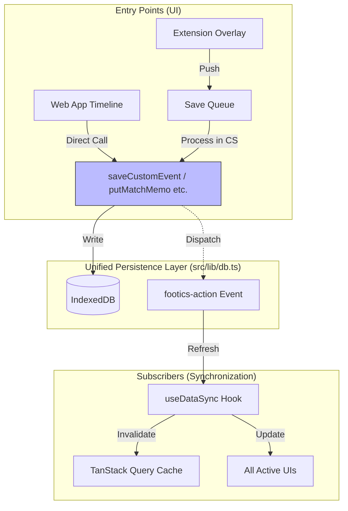

# Footics 統合保存・同期仕様書 (Unified Save & Sync Spec)

本ドキュメントは、Footics プロジェクトにおける Web 本体とブラウザ拡張機能のデータ同期メカニズムの最終仕様を定義するものである。

## 1. アーキテクチャの概要

データの一貫性を保つため、**「保存レイヤーの共通化」** と **「DOMイベントによる同期の自動化」** を採用する。

### 核心となる原則
1.  **保存の共通窓口**: すべてのデータ書き込みは `src/lib/db.ts` の関数を介して行う。
2.  **自動通知の義務**: DB 書き込み関数は、物理的な保存の直後に必ず同期イベントを発火させる。
3.  **イベントの単一化**: 同期には標準の `CustomEvent ('footics-action')` を使用し、拡張機能のブリッジメッセージは使用しない。

---

## 2. システム構成図



---

## 3. 実装詳細

### A. 同期イベントの形式
- **イベント名**: `footics-action`
- **ペイロード (`detail`)**:
  ```typescript
  {
    action: 'REFRESH_DATA',
    matchId?: string // 影響を受ける試合ID（任意）
  }
  ```

### B. DBレイヤーの責務 (`db.ts`)
すべての書き込み関数は以下の `dispatchRefreshEvent` ヘルパーを呼び出さなければならない。

```typescript
export function dispatchRefreshEvent(matchId?: string | number): void {
  if (typeof window === 'undefined') return;
  window.dispatchEvent(
    new CustomEvent('footics-action', {
      detail: {
        action: SHORTCUT_ACTIONS.REFRESH_DATA,
        matchId: matchId ? String(matchId) : undefined,
      },
    }),
  );
}
```

---

## 4. 運用上の注意

- **拡張機能のブリッジ**: 以前使用されていた `REFRESH_APP` メッセージは廃止された。DOM イベントが Isolated World と Main World を直接跨ぐことができるため、ブリッジを介する必要はない。
- **無限ループの防止**: 同期イベントを受け取った UI は、データの再取得（Query の Invalidate）のみを行い、そこから更なる保存処理を自動で連鎖させてはならない。
